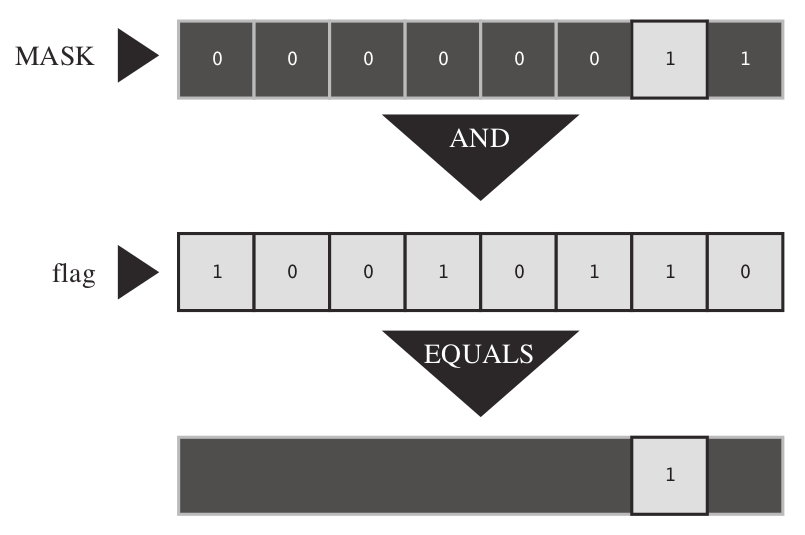

# Bitwise Logical Operators

<!-- TOC -->

- [1. Bitwise Negation: `~`](#1-bitwise-negation)
- [2. Bitwise AND: `&`](#2-bitwise-and)
- [3. Bitwise OR: `|`](#3-bitwise-or)
- [4. Bitwise EXCLUSIVE OR: `^`](#4-bitwise-exclusive-or)
- [5. Usage](#5-usage)
  - [5.1. Masks](#51-masks)
  - [5.2. Turning Bits On (Setting Bits)](#52-turning-bits-on-setting-bits)
  - [5.3. Turning Bits Off (Clearing Bits)](#53-turning-bits-off-clearing-bits)
  - [5.4. Toggling Bits](#54-toggling-bits)
  - [5.5. Checking the Value of a Bit](#55-checking-the-value-of-a-bit)

<!-- /TOC -->

The four bitwise logical operators work on integer-type data, including `char`. They are called **bitwise** because they operate on each bit independently of the bit to the left or right. Don’t confuse them with the regular logical operators ( `&&`, `||`, and `!`), which operate on values as a whole.

## 1. Bitwise Negation: `~`

The unary operator `~` changes each 1 to a 0 and each 0 to a 1, as in the following example:

```text
~(10011010) // expression
 (01100101) // resulting value
```

Suppose that `val` is an `unsigned char` assigned the value `2`. In binary, `2` is `00000010`. Then `~val` has the value `11111101`, or `253`.

If you want to change the value of `val` to `~val`, use this simple assignment:

```c
val = ~val;
```

## 2. Bitwise AND: `&`

The binary operator `&` produces a new value by making a bit-by-bit comparison between two operands. For each bit position, the resulting bit is 1 only if both corresponding bits in the operands are `1`. (In terms of `true`/`false`, the result is `true` only if each of the two bit operands is `true`.) Therefore, the expression

```text
(10010011) & (00111101) // expression
```

evaluates to the following value:

```text
(00010001) // resulting value
```

C also has a combined bitwise AND-assignment operator: `&=`. The statement

```c
val &= 0377;
```

produces the same final result as the following:

```c
val = val & 0377;
```

## 3. Bitwise OR: `|`

The binary operator `|` produces a new value by making a bit-by-bit comparison between two operands. For each bit position, the resulting bit is 1 if either of the corresponding bits in the operands is 1. (In terms of `true`/`false`, the result is `true` if one or the other bit operands are `true` or if both are `true`.) Therefore, the expression

```text
(10010011) | (00111101) // expression
```

evaluates to the following value:

```text
(10111111) // resulting value
```

C also has a combined bitwise OR-assignment operator: `|=`. The statement

```c
val |= 0377;
```

produces the same final result as this:

```c
val = val | 0377;
```

## 4. Bitwise EXCLUSIVE OR: `^`

The binary operator `^` makes a bit-by-bit comparison between two operands. For each bit position, the resulting bit is 1 if one or the other (but not both) of the corresponding bits in the operands is 1. (In terms of `true`/`false`, the result is `true` if one or the other bit operands—but not both— is `true`.) Therefore, the expression

```c
(10010011) ^ (00111101) // expression
```

evaluates to the following:

```c
(10101110) // resulting value
```

C also has a combined bitwise OR-assignment operator: `^=`. The statement

```c
val ^= 0377;
```

produces the same final result as this:

```c
val = val ^ 0377;
```

## 5. Usage

### 5.1. Masks

The bitwise **AND** operator is often used with a **mask**. A **mask** is a bit pattern with some bits set to on (`1`) and some bits to off (`0`). To see why a mask is called a **mask**, let’s see what happens when a quantity is combined with a **mask** by using `&`.

For example, suppose you define the symbolic constant `MASK` as 2 (that is, binary `00000010`), with only bit number 1 being nonzero. Then the statement

```c
flags = flags & MASK;
```

would cause all the bits of `flags` (except bit 1) to be set to `0` because any bit combined with `0` using the `&` operator yields `0`. Bit number 1 will be left unchanged. (If the bit is 1, 1 & 1 is 1; if the bit is 0, 0 & 1 is 0.) This process is called “**using a mask**” because the zeros in the mask hide the corresponding bits in `flags`.

Extending the analogy, you can think of the `0`s in the mask as being **opaque** and the `1`s as being **transparent**. The expression `flags & MASK` is like covering the `flags` bit pattern with the mask; only the bits under `MASK`’s 1s are visible.



You can shorten the code by using the AND-assignment operator, as shown here:

```c
flags &= MASK;
```

One common C usage is this statement:

```c
ch &= 0xff; /* or ch &= 0377; */
```

The value `0xff` is `11111111` in binary, as is the value `0377`. This mask leaves the final 8 bits of `ch` alone and sets the rest to `0`. Regardless of whether the original `ch` is 8 bits, 16 bits, or more, the final value is trimmed to something that fits into a single 8-bit byte. In this case, the mask is 8 bits wide.

### 5.2. Turning Bits On (Setting Bits)

Sometimes you might need to turn on particular bits in a value while leaving the remaining bits unchanged.

For example, consider the `MASK`, which has bit 1 set to 1. The statement

```c
flags = flags | MASK;
```

For short, you can use the bitwise OR-assignment operator:

```c
flags |= MASK;
```

### 5.3. Turning Bits Off (Clearing Bits)

Just as it’s useful to be able to turn on particular bits without disturbing the other bits, it’s useful to be able to turn them off. 

Suppose you want to turn off bit 1 in the variable `flags`. Once again, `MASK` has only the 1 bit turned on. You can do this:

```c
flags = flags & ~MASK;
```

You can use this short form instead:

```c
flags &= ~MASK;
```

### 5.4. Toggling Bits

Toggling a bit means turning it **off** if it is **on**, and turning it **on** if it is **off**. You can use the bitwise **EXCLUSIVE OR** operator to toggle a bit.

You can do either of the following:

```c
flags = flags ^ MASK;
flags ^= MASK;
```

### 5.5. Checking the Value of a Bit

You’ve seen how to change the values of bits. Suppose, instead, that you want to check the value of a bit. For example, does flags have bit 1 set to 1?

You shouldn’t simply compare `flags` to `MASK`:

```c
if (flags == MASK)
    puts("Wow!"); /* doesn't work right */
```

Instead, you must first mask the other bits in flags so that you compare only bit 1 of `flags` with `MASK`:

```c
if ((flags & MASK) == MASK)
    puts("Wow!");
```
