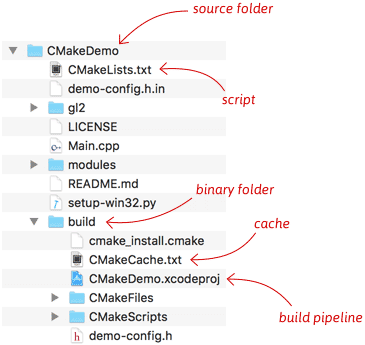
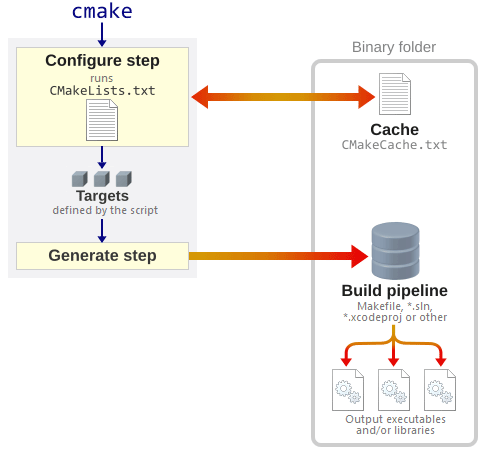

# CMake

**CMake** is **a versatile tool** that **helps you build C/C++ projects** on just about any platform you can think of. It’s used by many popular open source projects including LLVM, Qt, KDE and Blender.

> 笔记：CMake是一个工具，用于构建C或C++的代码。CMake — a cross-platform alternative to linux Makefiles and make.

All CMake-based projects contain **a script** named `CMakeLists.txt`.

> 笔记：`CMakeLists.txt`的作用就是script。

If you don’t have CMake yet, there are installers and binary distributions [on the CMake website](https://cmake.org/download/). In Unix-like environments, including Linux, it’s usually available through the system package manager. You can also install it through [MacPorts](https://www.macports.org/), [Homebrew](https://brew.sh/), [Cygwin](https://www.cygwin.com/) or [MSYS2](http://www.msys2.org/).

> 笔记：要使用CMake，要先安装。

## The Source and Binary Folders

CMake generates **build pipelines**. A build pipeline might be a Visual Studio `.sln` file, an Xcode `.xcodeproj` or a Unix-style `Makefile`. It can also take several other forms.

> 笔记：这里引出一个新概念build pipelines，同时这个概念是一个抽象概念，它有多种不同的具体存在形式。

To generate a **build pipeline**, CMake needs to know **the source** and **binary folders**. **The source folder** is the one containing `CMakeLists.txt`. **The binary folder** is where CMake generates the **build pipeline**. You can create the binary folder anywhere you want. A common practice is to create a subdirectory `build` beneath `CMakeLists.txt`.

> 笔记：由build pipeline这个概念，又引出两个概念，即the source folder和the binary folder。



By keeping the binary folder separate from the source, you can delete the binary folder at any time to get back to a clean slate. You can even create several binary folders, side-by-side, that use different build systems or configuration options.

The **cache** is an important concept. It’s a single text file in **the binary folder** named `CMakeCache.txt`. This is where **cache variables** are stored. **Cache variables** include **user-configurable options** defined by the project such as CMakeDemo’s `DEMO_ENABLE_MULTISAMPLE` option (explained later), and **precomputed information** to help speed up CMake runs. (You can, and will, re-run CMake several times on the same binary folder.)

> 笔记：这里引出一个新概念cache，而`CMakeCache.txt`文件就是对这个概念的具体实现。

You aren’t meant to submit **the generated build pipeline** to **source control**, as it usually contains paths that are hardcoded to the local filesystem. Instead, simply re-run CMake each time you clone the project to a new folder. I usually add the rule `*build*/` to my `.gitignore` files.

> 笔记：这里的要点就是，不要将build pipeline提交到source control当中。

## The Configure and Generate Steps

As you’ll see in the following sections, there are several ways to run CMake. No matter how you run it, it performs **two steps**: **the configure step** and **the generate step**.

> 笔记：这里是从运行（或者说“动态”）的角度来讲的，要经过两个步骤：configure和generate。



The `CMakeLists.txt` script is executed during **the configure step**. **This script** is responsible for defining **targets**. **Each target** represents **an executable, library**, or some other output of the build pipeline.

> 笔记：理解好这样一个思路就好，the configure step --> CMakeLists.txt --> targets --> executable, library

If **the configure step** succeeds – meaning `CMakeLists.txt` completed without errors – CMake will generate **a build pipeline** using the **targets** defined by the script. The type of build pipeline generated depends on the type of **generator** used, as explained in the following sections.

> 笔记：思路为the configure step --> CMakeLists.txt --> targets --> generator --> build pipeline

## A Basic Starting Point (Step 1)

The most basic project is **an executable** built from **source code files**. For simple projects, a three line `CMakeLists.txt` file is all that is required. This will be the starting point for our tutorial. Create a `CMakeLists.txt` file which looks like:

```text
cmake_minimum_required(VERSION 3.10)

# set the project name
project(Tutorial)

# add the executable
add_executable(Tutorial tutorial.cxx)
```


## Reference

- [CMake Tutorial](https://cmake.org/cmake/help/latest/guide/tutorial/index.html) 这个是Official Documentation，有点看不下去
- [How to Build a CMake-Based Project](https://preshing.com/20170511/how-to-build-a-cmake-based-project/) 这个文章写的很好。
