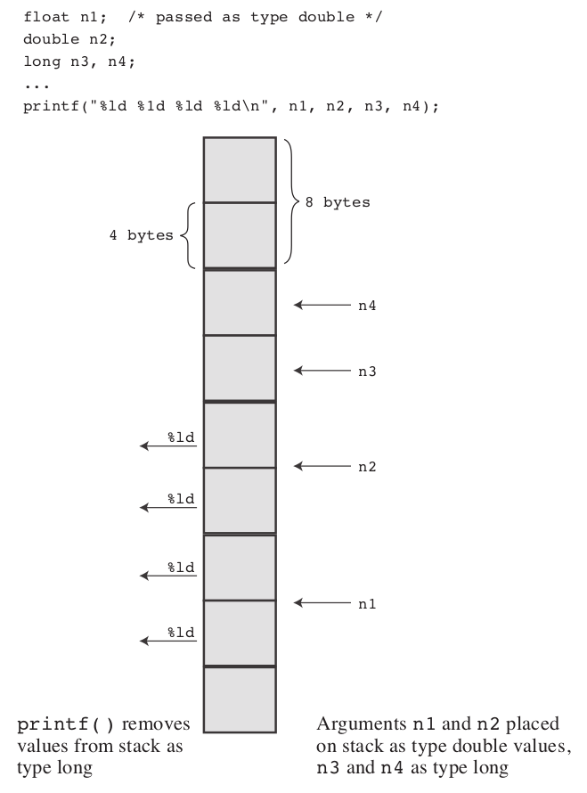

# printf

<!-- TOC -->

- [1. Syntax](#1-syntax)
  - [1.1. Conversion Specifications](#11-conversion-specifications)
  - [1.2. Conversion Specification Modifiers for `printf()`](#12-conversion-specification-modifiers-for-printf)
    - [1.2.1. Flags](#121-flags)
  - [1.3. The Return Value of `printf()`](#13-the-return-value-of-printf)
  - [1.4. What Does a Conversion Specification Convert?](#14-what-does-a-conversion-specification-convert)
- [2. Mismatched Conversions](#2-mismatched-conversions)
  - [2.1. Passing Arguments](#21-passing-arguments)
- [3. Examples](#3-examples)
  - [3.1. float](#31-float)
  - [3.2. string](#32-string)

<!-- /TOC -->

This is the format for using `printf()`:

```c
printf( Control-string, item1, item2, ...);
```

## 1. Syntax

### 1.1. Conversion Specifications

The instructions you give `printf()` when you ask it to print a variable depend on the variable type. For example, we have used the `%d` notation when printing an **integer** and the `%c` notation when printing a **character**. These notations are called **conversion specifications** because they specify how the data is to be converted into displayable form.

Conversion Specifiers and the Resulting Printed Output:

- `%a`: Floating-point number, hexadecimal digits and p-notation (C99/C11).
- `%A`: Floating-point number, hexadecimal digits and P-notation (C99/C11).
- `%c`: Single character.
- `%d`: Signed decimal integer.
- `%e`: Floating-point number, e-notation.
- `%E`: Floating-point number, e-notation.
- `%f`: Floating-point number, decimal notation.
- `%g`: Use `%f` or `%e`, depending on the value. The `%e` style is used if the exponent is less than `-4` or greater than or equal to the precision.
- `%G`: Use `%f` or `%E`, depending on the value. The `%E` style is used if the exponent is less than `-4` or greater than or equal to the precision.
- `%i`: Signed decimal integer (same as `%d`).
- `%o`: Unsigned octal integer.
- `%p`: A pointer.
- `%s`: Character string.
- `%u`: Unsigned decimal integer.
- `%x`: Unsigned hexadecimal integer, using hex digits `0f`.
- `%X`: Unsigned hexadecimal integer, using hex digits `0F`.
- `%%`: Prints a percent sign.

### 1.2. Conversion Specification Modifiers for `printf()`

You can modify **a basic conversion specification** by inserting **modifiers** between the `%` and **the defining conversion character**.

The printf() Modifiers:

- `flag`: The five flags (`-`, `+`, `space`, `#`, and `0`). Zero or more flags may be present. Example: `"%-10d"`.
- `digit(s)`: **The minimum field width**. A wider field will be used if the printed number or string won’t fit in the field. Example: `"%4d"`.
- `.digit(s)`: **Precision**. For `%e`, `%E`, and `%f` conversions, the number of digits to be printed to the right of the decimal. For `%g` and `%G` conversions, the maximum number of significant digits. For `%s` conversions, the maximum number of characters to be printed. For integer conversions, the minimum number of digits to appear; leading zeros are used if necessary to meet this minimum. Using only `.` implies a following zero, so `%.f` is the same as `%.0f`. Example: `"%5.2f"` prints a float in a field five characters wide with two digits after the decimal point.
- `h`: Used with an integer conversion specifier to indicate a `short int` or `unsigned short int` value. Examples: `"%jd"` and `"%8jX"`.
- `l`: Used with an integer conversion specifier to indicate a `long int` or `unsigned long int`. Examples: `"%ld"` and `"%8lu"`.
- `ll`: Used with an integer conversion specifier to indicate a `long long int` or `unsigned long long int`. (C99). Examples: `"%lld"` and `"%8llu"`.
- `L`: Used with a floating-point conversion specifier to indicate a `long double` value. Examples: `"%Lf"` and `"%10.4Le"`.
- `t`: Used with an integer conversion specifier to indicate a `ptrdiff_t` value. This is the type corresponding to the difference between two pointers. (C99). Examples: `"%td"` and `"%12ti"`.
- `z`: Used with an integer conversion specifier to indicate a `size_t` value. This is the type returned by `sizeof`. (C99). Examples: `"%zd"` and `"%12zx"`.

The `sizeof` operator returns the size, in bytes, of a type or value. This should be some form of integer, but the standard only provides that it should be an **unsigned integer**. Thus it could be `unsigned int`, `unsigned long`, or even `unsigned long long`. So, if you were to use `printf()` to display a `sizeof` expression, you might use `%u` on one system, `%lu` one another, and `%llu` on a third. This means you would need to research the correct usage for your system and that you might need to alter your program if you move it to a different system. Well, it would have meant that except that C provides help to make the type more portable. First, the `stddef.h` header file (included when you include `stdio.h`) defines `size_t` to be whatever the type your system uses for `sizeof`; this is called the **underlying type**. Second, `printf()` uses the `z` modifier to indicate the corresponding type for printing.

> 笔记：这里重点介绍了`size_t`类型和`z`。

#### 1.2.1. Flags

- `-`: The item is left-justified; that is, it is printed beginning at the left of the field. Example: `"%-20s"`.
- `+`: Signed values are displayed with a plus sign, if positive, and with a minus sign, if negative. Example: `"%+6.2f"`.
- `space`: Signed values are displayed with a leading space (but no sign) if positive and with a minus sign if negative. A `+` flag overrides a space. Example: `"% 6.2f"`.
- `#`: Use an alternative form for the conversion specification. Produces an initial `0` for the `%o` form and an initial `0x` or `0X` for the `%x` or `%X` form, respectively. For all floating-point forms, `#` guarantees that a decimal-point character is printed, even if no digits follow. For `%g` and `%G` forms, it prevents trailing zeros from being removed. Examples: `"%#o"`, `"%#8.0f"`, and `"%+#10.3E"`.
- `0`: For numeric forms, pad the field width with **leading zeros** instead of with spaces. This flag is ignored if a `-` flag is present or if, for an integer form, a precision is specified. Examples: `"%010d"` and `"%08.3f"`.

### 1.3. The Return Value of `printf()`

The `printf()` function has **a return value**; it returns **the number of characters it printed**. If there is **an output error**, `printf()` returns **a negative value**. (Some ancient versions of `printf()` have different return values.)

### 1.4. What Does a Conversion Specification Convert?

Let’s take a closer look at **what a conversion specification converts**. It converts **a value stored in the computer in some binary format** to **a series of characters (a string) to be displayed**. For example, the number `76` may be stored internally as binary `01001100`. The `%d` conversion specifier converts this to the characters `7` and `6`, displaying `76`. The `%x` conversion converts the same value (`01001100`) to the hexadecimal representation `4c`. The `%c` converts the same value to the character representation `L`.

The term **conversion** is probably **somewhat misleading** because it might suggest that the original value is replaced with a converted value. **Conversion specifications** are really **translation specifications**; `%d` means “translate the given value to a decimal integer text representation and print the representation.”

## 2. Mismatched Conversions

Naturally, you should match the **conversion specification** to **the type of value being printed**. Often, you have choices. For instance, if you want to print a type `int` value, you can use `%d`, `%x`, or `%o`. All these specifiers assume that you are printing a type `int` value; they merely provide different representations of the value. Similarly, you can use `%f`, `%e`, or `%g` to represent a type `double` value.

What if you mismatch the **conversion specification** to the **type**? Mismatches can cause problems. This is a very important point to keep in mind.

```c
#include <stdio.h>
int main(void)
{
    float n1 = 3.0;
    double n2 = 3.0;
    long n3 = 2000000000;
    long n4 = 1234567890;

    printf("%.1e %.1e %.1e %.1e\n", n1, n2, n3, n4);
    printf("%ld %ld\n", n3, n4);
    printf("%ld %ld %ld %ld\n", n1, n2, n3, n4);

    return 0;
}
```

### 2.1. Passing Arguments

The mechanics of argument passing depend on the implementation. This is how argument passing works on one system. The function call looks as follows:

```c
printf("%ld %ld %ld %ld\n", n1, n2, n3, n4);
```

This call tells the computer to hand over the values of the variables `n1`, `n2`, `n3`, and `n4` to the computer. Here’s one common way that’s accomplished. The program places the values in an area of memory called **the stack**. When the computer puts these values on the stack, it is guided by the types of the variables, not by the conversion specifiers. Consequently, for `n1`, it places 8 bytes on the stack (`float` is converted to `double`). Similarly, it places 8 more bytes for `n2`, followed by 4 bytes each for `n3` and `n4`. Then control shifts to the `printf()` function.

> 笔记：这里是强调从内存空间的角度上来讲，variable是如何在stack排列的

This function reads the **values** off **the stack** but, when it does so, it reads them according to the **conversion specifiers**. The `%ld` specifier indicates that `printf()` should read 4 bytes, so `printf()` reads the first 4 bytes in the stack as its first value. This is just the first half of `n1`, and it is interpreted as a `long` integer. The next `%ld` specifier reads 4 more bytes; this is just the second half of `n1` and is interpreted as a second `long` integer. Similarly, the third and fourth instances of `%ld` cause the first and second halves of `n2` to be read and to be interpreted as two more `long` integers, so although we have the correct specifiers for `n3` and `n4`, `printf()` is reading the wrong bytes.

> 笔记：这里是强调`printf()`方法本身，如何将stack上的value取过来，然后按照一定的格式进行输出。



## 3. Examples

### 3.1. float

The `%1.2f` in the `printf()` statement causes the printout to be rounded to two decimal places.

### 3.2. string

The `%s` tells `printf()` to print a string.
