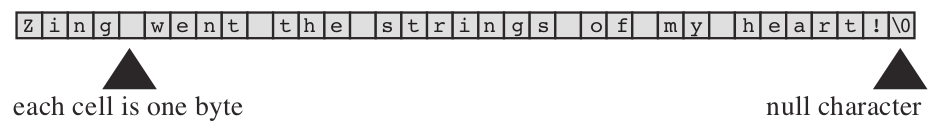
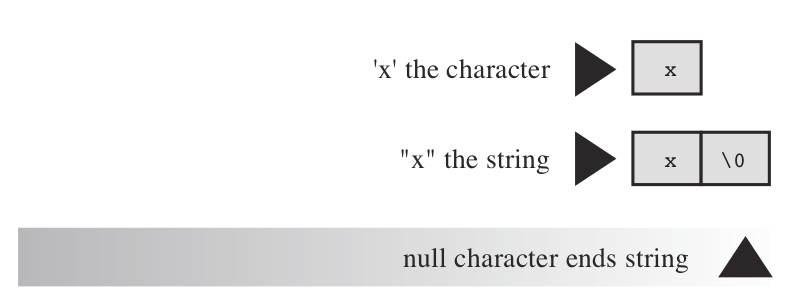

# Character Strings: An Introduction

<!-- TOC -->

- [1. Type char Arrays and the Null Character](#1-type-char-arrays-and-the-null-character)
- [2. Strings Versus Characters](#2-strings-versus-characters)
- [3. Examples](#3-examples)

<!-- /TOC -->

**A character string** is **a series of one or more characters**. Here is an example of a string:

```c
"Zing went the strings of my heart!"
```

## 1. Type char Arrays and the Null Character

C has **no special variable type** for **strings**. Instead, **strings** are stored in **an array of type `char`**. Characters in a string are stored in adjacent memory cells, one character per cell, and an array consists of adjacent memory locations, so placing a string in an array is quite natural.

> 笔记：在C语言中，对于strings来说，并不存在相应的类型（no special variable type），而是通过`char[]`来进行表示。



Note that the character `\0` is in the last array position. This is **the null character**, and C uses it to mark the end of a string. The null character is not the digit zero; it is the nonprinting character whose ASCII code value (or equivalent) is `0`. Strings in C are always stored with this terminating null character. The presence of the null character means that the array must have at least one more cell than the number of characters to be stored.

> 笔记：这里在介绍null character。

## 2. Strings Versus Characters

The string constant `"x"` is not the same as the character constant `'x'`. One difference is that `'x'` is a basic type (`char`), but `"x"` is a derived type, an array of `char`. A second difference is that `"x"` really consists of two characters, `'x'` and `'\0'`, the **null character**.



## 3. Examples

直接赋值：

```c
char chars[30] = "This is an example String.";
```

从控制台进行读取：

```c
char name[40];
printf("Hi! What's your first name?\n");
scanf("%s", name);
```


